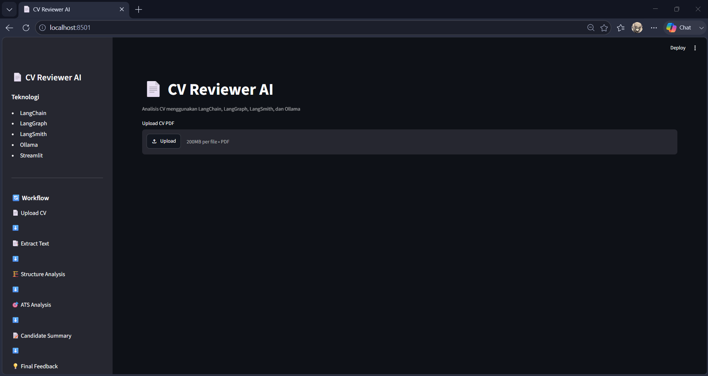
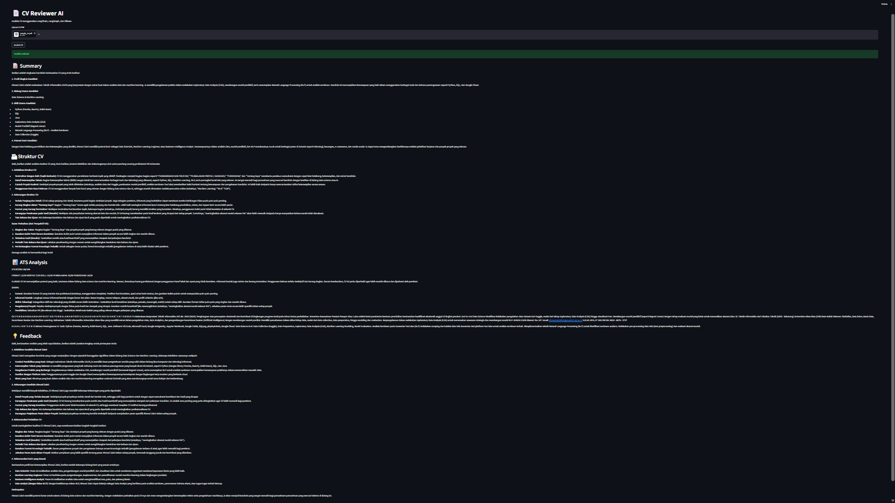
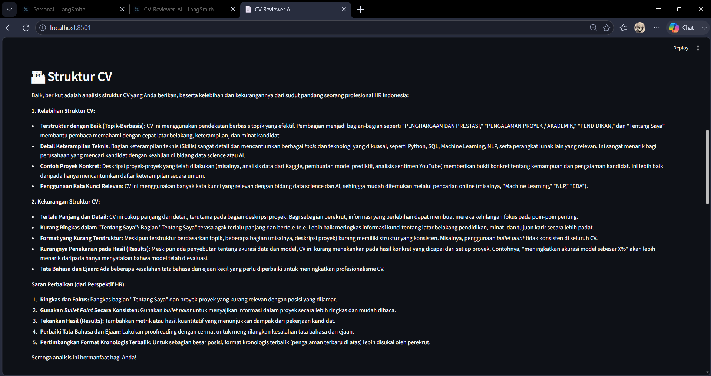
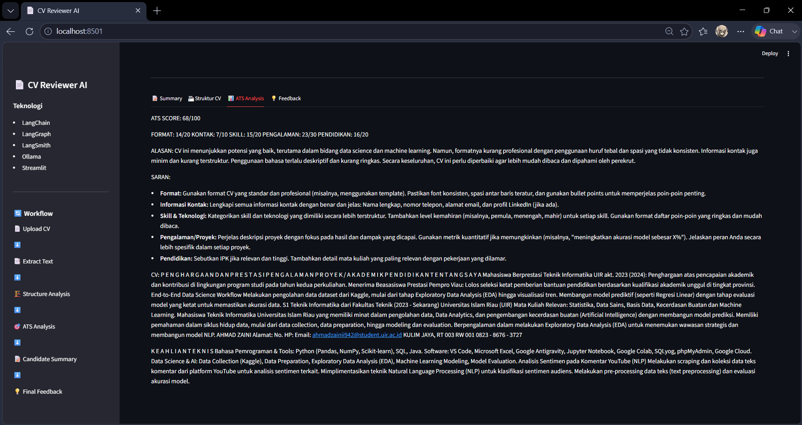
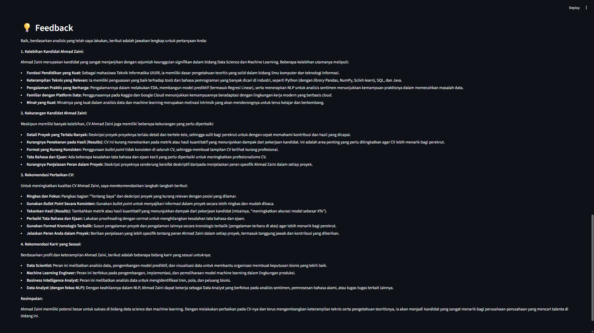
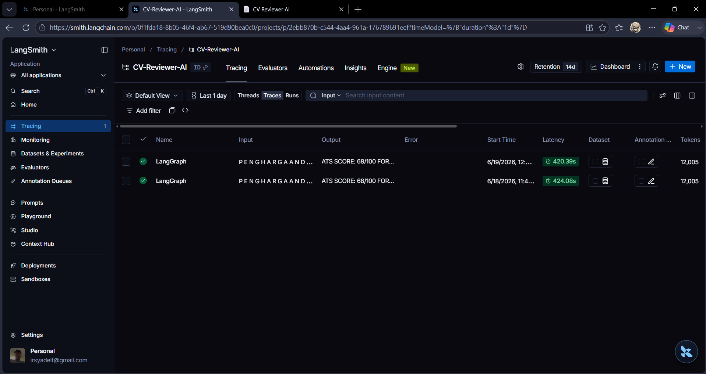
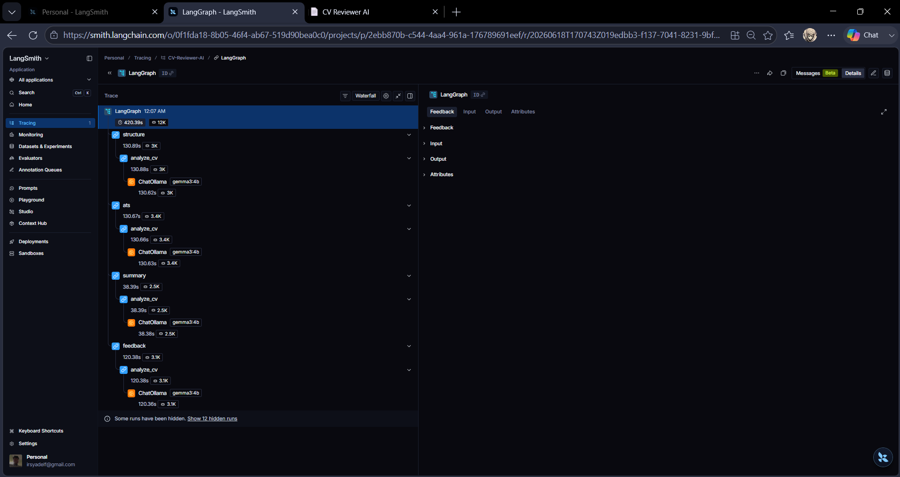

# 📄 CV Reviewer AI

## Deskripsi Proyek

CV Reviewer AI adalah aplikasi berbasis Natural Language Processing (NLP) dan Large Language Model (LLM) yang digunakan untuk menganalisis Curriculum Vitae (CV) dalam format PDF secara otomatis.

Aplikasi ini mampu memberikan ringkasan kandidat, analisis struktur CV, penilaian ATS (Applicant Tracking System), serta rekomendasi perbaikan CV. Sistem dibangun menggunakan LangChain, LangGraph, dan LangSmith sesuai dengan kebutuhan tugas UAS mata kuliah Natural Language Processing.

---

## Tujuan Proyek

Banyak pencari kerja kesulitan mengetahui apakah CV mereka telah memenuhi standar ATS dan praktik terbaik rekrutmen modern. Oleh karena itu, proyek ini dibuat untuk membantu pengguna mendapatkan evaluasi CV secara otomatis menggunakan teknologi LLM.

---

## Fitur Utama

✅ Upload CV dalam format PDF

✅ Ekstraksi teks otomatis dari PDF

✅ Analisis struktur CV

✅ Analisis ATS (Applicant Tracking System)

✅ Ringkasan kandidat (Candidate Summary)

✅ Feedback dan rekomendasi perbaikan

✅ Monitoring dan tracing menggunakan LangSmith

---

## Teknologi yang Digunakan

### Backend & AI

* Python
* Ollama
* Gemma 3 4B

### Framework LLM

* LangChain
* LangGraph
* LangSmith

### Frontend

* Streamlit

### PDF Processing

* PyPDF

---

## Arsitektur Sistem

```text
CV PDF
   │
   ▼
Extract Text (PyPDF)
   │
   ▼
LangGraph Workflow
   │
   ├── Structure Analysis
   ├── ATS Analysis
   ├── Candidate Summary
   └── Final Feedback
   │
   ▼
Gemma 3 4B (Ollama)
   │
   ▼
Streamlit Interface
   │
   ▼
LangSmith Monitoring
```

---

## Implementasi LangChain

Pada proyek ini LangChain digunakan untuk:

### PromptTemplate

Digunakan untuk membuat prompt dinamis berdasarkan isi CV yang diunggah pengguna.

### ChatOllama

Digunakan untuk menghubungkan aplikasi dengan model Gemma 3 4B yang dijalankan melalui Ollama.

### Chain

Digunakan untuk membangun alur pemrosesan:

```python
chain = prompt | llm | parser
```

### Output Parser

Menggunakan StrOutputParser untuk memproses hasil keluaran model menjadi format teks yang dapat digunakan oleh aplikasi.

---

## Implementasi LangGraph

LangGraph digunakan untuk membangun workflow analisis CV dalam bentuk graph.

Node yang digunakan:

1. Structure Analysis
2. ATS Analysis
3. Candidate Summary
4. Final Feedback

Workflow:

```text
Structure
   ↓
ATS
   ↓
Summary
   ↓
Feedback
```

---

## Implementasi LangSmith

LangSmith digunakan untuk:

* Tracing setiap eksekusi workflow
* Monitoring performa model
* Melihat input dan output setiap node
* Analisis latency dan debugging

Contoh trace yang direkam:

```text
ATS
 └── analyze_cv
      └── ChatOllama

Summary
 └── analyze_cv
      └── ChatOllama

Feedback
 └── analyze_cv
      └── ChatOllama
```

---

## Struktur Folder

```text
cv-reviewer-ai/
│
├── data/
│   └── sample_cv.pdf
│
├── screenshots/
│   ├── langsmith-dashboard.png
│   ├── langsmith-trace.png
│   ├── streamlit-ats.png
│   ├── streamlit-feedback.png
│   ├── streamlit-home.png
│   ├── streamlit-structure.png
│   └── streamlit-summary.png
│
├── app.py
├── cv_analyzer.py
├── main.py
├── pdf_reader.py
├── workflow.py
├── README.md
├── requirements.txt
├── .gitignore
└── .env (lokal, tidak diupload ke GitHub)
```

---

## Screenshot

### Halaman Utama



### Candidate Summary



### Struktur CV



### ATS Analysis



### Feedback dan Rekomendasi



### LangSmith Dashboard



### LangSmith Trace Detail



---

## Cara Instalasi

### 1. Clone Repository

```bash
git clone https://github.com/irsyadelfikri/UAS-PRAK-NLP.git
cd UAS-PRAK-NLP
```

### 2. Buat Virtual Environment

```bash
python -m venv venv
```

### 3. Aktifkan Virtual Environment

Windows:

```bash
venv\Scripts\activate
```

### 4. Install Dependency

```bash
pip install -r requirements.txt
```

### 5. Jalankan Ollama

Pastikan model Gemma 3 4B sudah tersedia:

```bash
ollama pull gemma3:4b
```

Jalankan Ollama:

```bash
ollama run gemma3:4b
```

### 6. Konfigurasi LangSmith

Buat file `.env`

```env
LANGCHAIN_TRACING_V2=true
LANGCHAIN_API_KEY=YOUR_LANGSMITH_API_KEY
LANGCHAIN_PROJECT=CV-Reviewer-AI
```

### 7. Jalankan Aplikasi

```bash
streamlit run app.py
```

---

## Cara Penggunaan

1. Jalankan aplikasi Streamlit
2. Upload file CV dalam format PDF
3. Klik tombol **Analisis CV**
4. Tunggu proses analisis selesai
5. Lihat hasil Summary, Structure CV, ATS Analysis, dan Feedback

---

## Hasil yang Diperoleh

Aplikasi akan menghasilkan:

* Ringkasan kandidat
* Analisis struktur CV
* Penilaian ATS
* Rekomendasi perbaikan CV
* Feedback profesional

---

## Author

Nama: Irsyadel Fikri

Mata Kuliah: Natural Language Processing

Universitas: Universitas Islam Riau

Tahun: 2026
